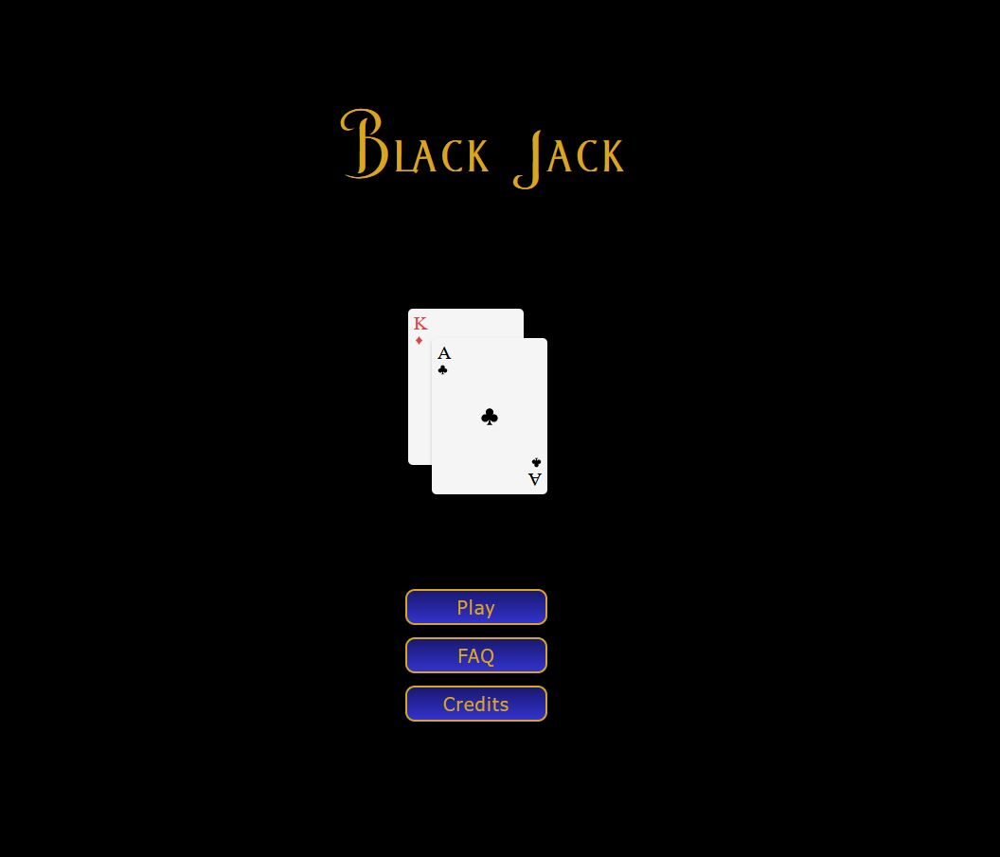

### Spela spelet här: 

[black-jack-carinwood.vercel.app](http://black-jack-carinwood.vercel.app)

#Dokumentation

## Sammanfattning

Jag ville göra ett kortspel och valde Black Jack eftersom jag har bra koll på reglerna och hur spelet går till. Jag valde att göra vissa avgränsningar i spelet då jag kände att det skulle bli för stort projekt om allting skulle finnas med. T.ex. kan man inte splitta, dubbla eller försäkra sig mot Black Jack. I övrigt har jag följt de internationella reglerna för Black Jack.

## Responsivitet

Jag har upplevt att folk jag känner i mindre utsträckning spelar mina spel om det inte går att spela dem på mobiltelefon. På grund av detta har tonvikt lagts på att göra spelet responsivt och därmed spelbart på mobiltelefon.

## Styling

Jag gick in i det här projektet med tanken om att jag ska göra all styling själv med hjälp av CSS, och det har jag också lyckats med. Jag har inspirerats av andra på nätet som gjort liknande styling av kort och marker, men i slutändan är det min egen kod, då jag inte har kopierat någonting rakt av utan, som sagt, endast har inspirerats av andra.

## Det svåraste med projektet

Det svåraste med det här projektet har varit att göra funktionen som beräknar vem som har vunnit. Det är ett antal scenarion som kan uppstå när dealern och användaren har dragit sina kort. Ässen i leken gör det hela komplicerat genom att de kan ha både värder 1 eller 11, vilket ökar antalet vinst- eller förlorarscenarior markant.

## Det roligaste med projektet

Det roligaste med det här projektet har varit att det har varit lagom utmanande för mig samt att se allting sakta men säkert växa fram. Det har känts som ett mycket kreativt och skapande projekt.